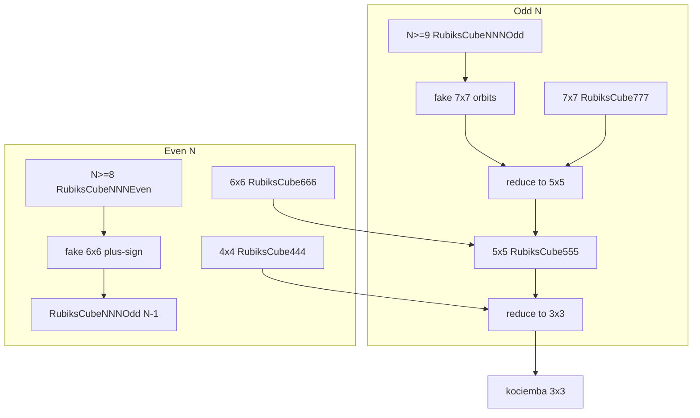
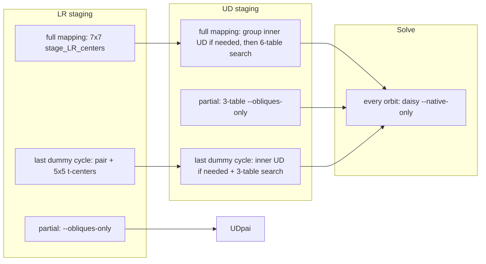

# Agent handbook: rubiks-cube-NxNxN-solve

Python reduction solver for any even/odd NxNxN cube, plus C IDA searchers. Sibling repo: `../rubiks-cube-lookup-tables` (builds the tables this solver downloads from S3).

## Rules

- Do **not** commit unless the user asks.
- Do **not** start production lookup-table builds. Tables already live on S3; the solver wget/gunzips them on demand into `lookup-tables/`.
- Do **not** force-push, amend pushed commits, or skip git hooks.
- Prefer editing existing phase code over inventing a parallel Python IDA. New ranked searches belong in a dedicated `ida_search_*.c`, not another `LookupTableIDAViaGraph` wrapper, unless the prune-table graph path is genuinely the right tool.
- Run C compiles and tests from **this repo root**. Python `Popen`s `./ida_search_*`.
- On the Windows workstation, compile and test inside WSL Ubuntu (`wsl -d Ubuntu-22.04`), not native PowerShell gcc.
- Project skills in `.cursor/skills/`: never CRLF (always LF); never keep unused lookup-table code in either repo; if a phase is slow, sample a heuristic matrix instead of shipping `--multiplier`.

## Layout

| Path | Role |
| --- | --- |
| `rubiks-cube-solver.py` | CLI: `--state` kociemba string, default order `URFDLB` |
| `rubikscubennnsolver/` | Cube classes, lookup-table loaders, C sources |
| `rubikscubennnsolver/ida_search_*.c` | Dedicated ranked IDA binaries |
| `rubikscubennnsolver/ida_search_via_graph.c` | Generic prune-table IDA (`./ida_search_via_graph`) |
| `rubikscubennnsolver/rotate_xxx.c`, `ida_search_core.c` | Shared rotate + IDA helpers |
| `lookup-tables/` | Downloaded (or locally copied) tables. Not built here. |
| `tests/` | Unit tests; several skip if the matching binary is missing |
| `utils/` | Benchmarks, cost-matrix rebuilders, `test-cubes.json` |
| `Makefile` | `init` (compile + venv), `format`, `test` |

Cube state arrays are **1-indexed** (index 0 unused). Face order in kociemba strings is U, R, F, D, L, B unless a caller passes another `--order`.

## Environment

```bash
make init          # gcc -O3 all searchers, venv, pip install -e .
source venv/bin/activate
```

3x3x3 finish needs the external kociemba binary (`dwalton76/kociemba`). Missing kociemba breaks `solve_333`, not center staging.

Missing tables: `download_file_if_needed()` fetches `https://rubiks-cube-lookup-tables.s3.amazonaws.com/<basename>.gz` into CWD then `gunzip`s. Always run from repo root so files land in `lookup-tables/`.

Recompile a single searcher after C edits (example):

```bash
gcc -O3 -o ida_search_777_UD_centers_stage \
  rubikscubennnsolver/ida_search_core.c \
  rubikscubennnsolver/rotate_xxx.c \
  rubikscubennnsolver/ida_search_777_UD_centers_stage.c -lm -lpthread
```

`make init` / `make clean` rebuilds or deletes every binary listed below. After C changes, rebuild the binary the tests invoke.

## Test and format

```bash
make format        # isort (limited dirs), black 120, flake8
make test          # pytest -vv tests
PYTHONPATH=. ./venv/bin/python3 -m unittest -v tests.test_ida_search_with_rotate.CenterStagingTablesTest
```

Focused C tests live next to each searcher (`tests/test_ida_search_777_UD_centers_stage.py`, …) and skip if the binary is absent. `tests/test_solve.py` solves one scramble per size from `utils/test-cubes.json` and needs tables plus kociemba.

`make format` isort only covers `rubikscubennnsolver usr utils` (not `tests/`). Black still formats the whole tree except venv.

## C searchers

| Binary | Source | Used for |
| --- | --- | --- |
| `ida_search_via_graph` | `ida_search_via_graph.c` + `ida_search_666.c` + `ida_search_777.c` | 4x4/5x5 (and leftover graph) prune-table IDA |
| `ida_search_666_centers_stage` | `ida_search_666_centers_stage.c` | 6x6 inner-x / LR-oblique / UD phase 3 |
| `ida_search_666_daisy_centers` | `ida_search_666_daisy_centers.c` | 6x6 daisy |
| `ida_search_777_centers_stage` | `ida_search_777_centers_stage.c` | 7x7 LR phase 2 (UD inner + LR obliques); `--obliques-only` for NNNOdd partial rings |
| `ida_search_777_UD_centers_stage` | `ida_search_777_UD_centers_stage.c` | 7x7 UD outer-x + obliques (6 tables) or `--obliques-only` (3 tables) |
| `ida_search_777_daisy_centers` | `ida_search_777_daisy_centers.c` | 7x7 daisy, or `--native-only` for 9x9+ |

Ranked searchers are pthread IDA. Graph searcher is the older prune-table stack. A `SOLUTION (N steps): …` line on stdout is the contract Python parses.

### Ranked `cost-only.bin`

Dense byte array, one byte per mixed-radix rank.

| Byte | Meaning |
| --- | --- |
| `0` | unseen / unreachable |
| `n > 0` | cost `n - 1` |

Pairwise 7x7 UD tables are \(C(16,8)^2 = 165{,}636{,}900\) bytes. C mmap size checks must match the builder metadata (`*.cost-only.bin.json`).

Sampled **cost matrices** (when max-of-axis is too weak) live as C arrays in the searcher and are rebuilt from the **solver** tree:

- `utils/build-666-all-inner-x-oblique-matrix.py`
- `utils/build-666-daisy-cost-matrix.py`
- `utils/build-777-UD-inner-centers-oblique-matrix.py`
- `utils/build-777-daisy-cost-matrix.py`
- `utils/build-777-solve-cost-matrix.py`

Do not start those jobs unless asked; they sample long IDA runs.

## Cube classes and reduction



| Size | Class | Reduce to | Notes |
| --- | --- | --- | --- |
| 2 | `RubiksCube222` | solved | Tiny tables |
| 3 | `RubiksCube333` | solved | kociemba |
| 4 | `RubiksCube444` | 3x3 | Phases 1+2 and 3+4 are **portfolios** |
| 5 | `RubiksCube555` | 3x3 | Graph IDA stages LR then FB centers (phases 1+2 as a portfolio) |
| 6 | `RubiksCube666` | 5x5 | Ranked inner-x; `--low-memory` / `--min-memory` can drop the huge table |
| 7 | `RubiksCube777` | 5x5 | Combined LR phase 2, 6-table UD, daisy (either orientation) |
| even ≥8 | `RubiksCubeNNNEven` | odd N−1 | Plus-sign via fake 6x6, pair inner wings via fake 4x4, then odd solver |
| odd ≥9 | `RubiksCubeNNNOdd` | 5x5 | Fake 7x7 per center orbit/cycle, then 5x5 edges |

Module docstrings on `RubiksCube444.py`, `555`, `666`, `777`, `NNNOdd.py`, `NNNEven.py` are the phase-level source of truth. Update them when you change a pipeline.

### 4x4 / 5x5 portfolios and parity

- `--solution-count` is only passed from Python when `> 1`. C default is 1.
- 4x4 phase 3 keeps a large portfolio (currently 2000) into phase 4.
- `avoid_oll` on a lookup object becomes `--orbit0-need-odd-w` / `--orbit0-need-even-w` (and orbit1 when used). Last-ply pruning in C skips a rotate if the next ply cannot meet that parity.
- 6x6: phase 1 owns **orbit1** OLL (later phases forbid `3Xw` quarters). Phase 3 owns **orbit0**.
- 7x7 daisy forbids wide quarters, so it **cannot** flip OLL. Fix parity while staging.

### 7x7 and NNNOdd centers



Dispatch is `RubiksCubeNNNOdd.stage_or_solve_inside_777`. Outer-x of the fake 7x7 are real only when `(orbit == 0 and cycle == 0)` or `(orbit == max and cycle == max)`.

| Slice | LR | UD |
| --- | --- | --- |
| Full mapping | Inherit 7x7 phase 1–3 (inner LR 5x5, combined phase 2, outer LR 5x5) | `group_inside_UD_centers()` (no-op if already staged) + 6 ranked tables |
| Intermediate cycle | `ida_search_777_centers_stage --obliques-only` (unpaired-count heuristic, no tables) | 3 ranked oblique tables, **no** outer-x |
| Last dummy cycle | Pair obliques, then fake-5x5 `lt_LR_t_centers_stage_ida` | Same 3-table search (middle obliques **are** outer t-centers) |

NNNOdd center **solve** always passes `native_only=True` and the `lookup-table-7x7x7-solve-*-perfect-centers.cost-only.bin` tables. Daisy tables score 0 at the swapped orientation, which is unsolved on 9x9+. The C daisy blanks outer-x to `.`, so dummy painted outer-x do not constrain the search.

Walk orbits **inside-out**. On 9x9, inner-orbit `w` rewrites as `3w` and would smash an already-solved outer ring.

Do not:

- Run the 6-table UD search on dummy outer-x (placeholders are painted as the face color).
- Collapse LR t-center staging into `--obliques-only` (LR t-centers are not LR obliques).
- Use daisy (either orientation) on NNNOdd rings.
- Interleave LR and UD per orbit (tried; keep all-LR then all-UD then all-solve).

Optional leftover: partial LR/UD searches do not pass `--orbit0-need-*`. Staging OLL on those rings can dump parity onto the matching wings.

## Table file types the solver reads

| Suffix | Typical consumer |
| --- | --- |
| `.txt` / `.bin` + `.state_index` | Classic `LookupTable` binary search |
| `.cost-only.bin` | Ranked C mmap |
| `.cost-only.bin.json` | Builder metadata (rank groups, universe size) |
| perfect-hash files | `ida_search_via_graph` combo heuristics |

Python ranked drivers (`LookupTableIDA777UDObliquesOuterXStage`, daisy, 6x6 daisy, NNNOdd pairing) `Popen` the C binary with `--kociemba` plus `--*-cost FILE` flags. Graph drivers use `LookupTableIDAViaGraph`.

## Adding or changing a ranked phase

1. Builder class + Makefile target in **lookup-tables** (user must ask before a real build).
2. C searcher: legal moves, rank function, mmap size, last-ply OLL if the phase can still flip an orbit.
3. Python: download flags, `avoid_oll` if needed, comments in the cube module docstring.
4. Unit test that can run on sparse temp tables (see existing `tests/test_ida_search_*`).
5. Rebuild the binary; run the focused test with `PYTHONPATH=.`.

## Pitfalls

- CWD must be the solver root (`wget` and `./ida_search_*`).
- `make clean` deletes searcher binaries; tests then skip or fail.
- `NOTES.txt` is historical scratch, not current architecture.
- Lookup-table **builders** import `rubikscubennnsolver`; keep rotate tables and square-index tuples in sync across repos.
